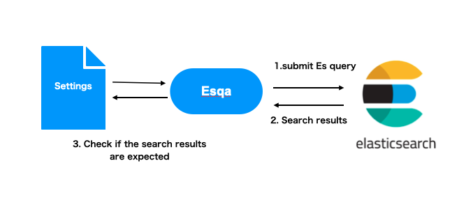

# Table of Contents

* [Overview](#Overview)
* [Install](#Install)
* [Behavior](#Behavior)
* [Usage](#Usage)
* [Configurations](#Configurations)

## Overview

**Esqa** automates the checks the qualities of the Elasticsearch indices
as the unit test frameworks such as RSpec or PyTests. Users add the test cases
into the setting files and checks if the target indices is build as expected running the command `esqa`. 

## Install

```bash
$ pip install esqa
```

## Behavior

When we run Esqa, the following steps are executed. 

1. Submit Es query to an Elasticsearch cluster 
2. Get the result ranking from Elasticsearch
3. Check if the rankings from Es cluster satisfy the conditions described in configuration file

The following is the image.



## Functions

Specfically esqa provides two functions, **assertion** and **compute distance**
between rankings from two index and query settings.

With assertion function, we can check if the results ranking satisfy the expectation for the specified queries.
With distance function, we can see the queries which is much different from previous settings (index and query`). 

The successive sections, we see the assertion and distance functions. 

## Assertion function

Esqa provides the `esqa` command which check if the queries gets the expected search rankings from Elasticsearch indices.

We run the `esqa` command specifying the configuration file and target index.

```shell
$ esqa assertion --config sample_config.json --index document-index
```

### Configurations

Esqa has the settings file in which we add the test cases. The following is an example of the setting file of esqa.
The setting file means that results from Elasticsearch clusters must satisfy the conditions defined in
`asserts` block when we run the defined query (searching `engineer` to the `message` field) to the target index.

```json
{
  "cases": [
    {
      "name": "match query",
      "request": {
        "query": {
          "match": {
            "message": {
              "query": "engineer"
            }
          }
        }
      },
      "asserts": [
        {
          "type": "equal",
          "rank": 0,
          "item": {
            "field": "document_id",
            "value": "24343"
          }
        }
      ]
    }
  ]
}
```

We add all the test cases into `cases` block.
Each test cases have three elements `name`, `request` and `asserts`.
`name` is the name of the test case. `request` is the target Es query which we want to validate.
We add a set of expected behaviors to the `asserts` block.  

The `asserts` block contains the conditions that search results from
Elasticsearch cluster must satisfy. Each condition
contains several elements `type`, `rank` and `item`. 

| Element | Summary |
| :--- | :--- |
| type | condition types (`equal`、`higher`、`lower`） |
| rank | rank of the specified item |
| item | item stored in Elasticsearch indices specified in rank element must satisfy |

`item` element specifies the document in Es indices. The item is specified with the field value.

| Element | Summary |
| :--- | :--- |
| field | field name |
| value | value of the field specified in `field` element |

### Templates

Sometimes queries in the test cases are almost the same.
In such cases, esqa provides *templates* in the configuration files.

Template files are JSON file which contains an Elasticsearch query
with **variables**.

The following is an example of template file. As we can see, `query`
block contains a variable `${query_str}`. The variables are injected
from the Esqa configuraiton file.

```json
{
  "query": {
    "match": {
      "message": {
        "query": "${query_str}"
      }
    }
  }
}
```

The following is a configuration file which specifies the template file.
To uses template files in the configuration file, we add `template` element in `query` block.
The variables in the specified template file need to be added in the `query` block.
For example the configuration file added a variable `query_str` defined in template file.

```json
{
  "templates": [
    {
      "name": "basic_query",
      "path": "tests/fixtures/default_template.json"
    }
  ],
  "cases": [
    {
      "name": "match identical",
      "request": {
        "template": "basic_query",
        "query_str": "engineer"
      },
      "asserts": [
        {
          "type": "equal",
          "rank": 0,
          "item": {
            "field": "id",
            "value": "2324"
          }
        }
      ]
    }
  ]
}
```

## Distance function

When we tune the Es indices, we somtimes want to compare the rankings from the previous indices.
Esqa computes the comparison between the rankings in the current settings and previous ones.

Before we run the command we prepare the configuration for the esqa distance function.
The format is the almost the same as validation settings except that the settings for
distance function does not have asseert blocks.


```json
{
  "templates": [{
    "name": "basic_query",
    "path": "sample/template.json"
  }],
  "cases": [
    {"request": {"template": "basic_query", "query_str":  "Windows PC"}, "name": "Windows PC"},
    {"request": {"template": "basic_query", "query_str": "Tablet"}, "name": "Tablet"}
  ]
}
```

Before we chagnge the Es settings, we run the ranking command specifying the configuration file.

```bash
esqa save --config sample/ranking.json --index sample > output/ranking_before_change.json
```

Then we change the Es index or query settings and run distance command specifing the ranking file.

```bash
esqa distance --config sample/compared_ranking.json --index sample --ranking output/ranking.json
[
  {
    "name": "Windows PC",
    "similarity": 0.5,
    "ranking_pair": [
      [
        "4",
        "6"
      ],
      [
        "5",
        "4"
      ],
      [
        "6",
        "5"
      ]
    ]
  },
  {
    "name": "Tablet",
    "similarity": 0.5416666666666666,
    "ranking_pair": [
      [
        "22",
        "21"
      ],
      [
        "23",
        "22"
      ],
      [
        "3",
        "23"
      ],
      [
        "21",
        "3"
      ]
    ]
  }
]
```

We get the query cases which change the rankings compared with the rankings before change the settings.
